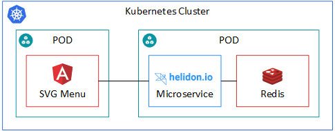

# Serverless Referenzarchitektur mit K8, Helidon MP, Redis, Angular - js_menus

Dieses Projekt zeigt eine prototypische und damit unvollständige Umsetzung einer entworfenen cloudbasierte Microservicereferenzarchitektur. Es dient als Ansatzpunkt für weitere Projekte und erprobt zugleich neue Technologien und Frameworks.

Die Anwendung besteht aus einer, mithilfe von Docker, containerisierten Angular-Anwendung, einem Helidon Microservice und einer Redis-Instanz. Die Angular-Anwendung stellt ein SVG-Menu (Siehe Dmeo unter Anwendung). Dieses dient als zentrale Anlaufstelle für den Zugriff auf verschiedene, im Unternehmen verwendete, Plattformen sowie den schnellen Zugriff auf Reportdaten wie beispielsweise die Laufzeit von nächtlich laufenden Batches in einer Produktiv- oder Testumgebung.

# Anwendung

# Quickstart Anleitung
[Quickstart](docs/readme.md)

# Grundlegende Referenzarchitektur

# Technologienstack

## Serverless-Framework
+ [Helidon MP](https://helidon.io)

## Plattform
+ [Docker](https://www.docker.com/)
+ [Kubernetes](https://kubernetes.io)
+ [NGINX](https://nginx.org/en/)

## Speicher
+ [Redis](https://redis.io/)

# Abdeckung

Nachfolgendes Bild zeigt die abgedeckten Bereiche der obenstehenden Referenzarchitektur.

Der Stack läuft aktuell lokal mit Docker-For-Desktop oder minikube.

Im Bereich Security ist SSL/TLS möglich (z.B. mithilfe eines selbst signierten Zertifikats).
Weiterhin wäre es in Zukunft, durch die in Kubernetes vorhandenen Secrets, möglich die Anwendung mittels HTTP-Auth zu sichern. 

Für den produktiveinsatz empfiehlt es sich zudem Technologien wie etwa Vault (also externe Keystorages) näher zu betrachten. So können Secrets von k8 getrennt verwaltet und zugleich verschlüsselt werden.

Das Aufsetzen einer FaaS-Plattform mithilfe von z.B. OpenFaaS wurde in einem anderen Projekt bereits erfolgreich durchgeführt. Aktuell wird für diese Anwendung keine FaaS-Plattform benötigt, daher ist dieses auch nicht im aktuellen Stack vertreten.

# Zusammenspiel
Nachfolgende Grafik zeigt die Komponenten von jsMenu im Zusammenspiel. 

    

Die Angular-Anwendung wird in einem eigenen POD bereitgestellt, während der Microservices eng an seine Daten (der Redis-Instanz) gebunden ist. Über den Microservice greift dei Angular-Anwendung auf die Redis-Instanz zu. 
Dabei werden die Daten aus Redis im passenden JSON-Format zurückgeliefert und schlussendlich auf der Oberfläche angezeigt.
